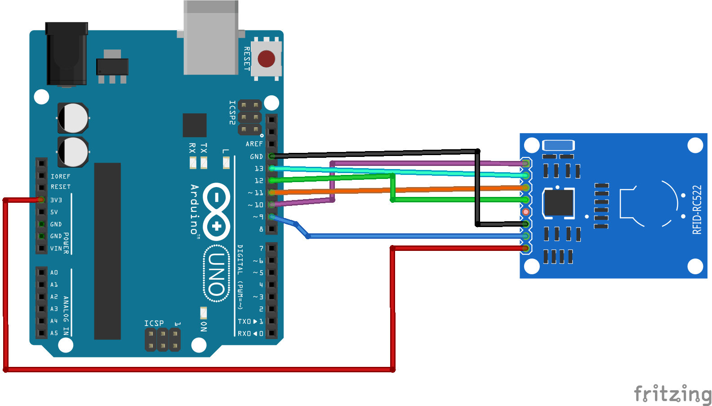

# MFRC522

Used the Arduino RFID Library for MFRC522 available at https://github.com/miguelbalboa/rfid

| Pin | Description | Wiring to Arduino Uno |
|---|---|---|
| 1 | SDA | Digital 10 |
| 2 | SCK	| Digital 13 |
| 3 | MOSI | Digital 11 |
| 4 | MISO | Digital 12 |
| 5 | IRQ	| unconnected |
| 6 | GND	| GND |
| 7 | RST	| Digital 9 | 
| 8 | 3.3V | 3.3V |